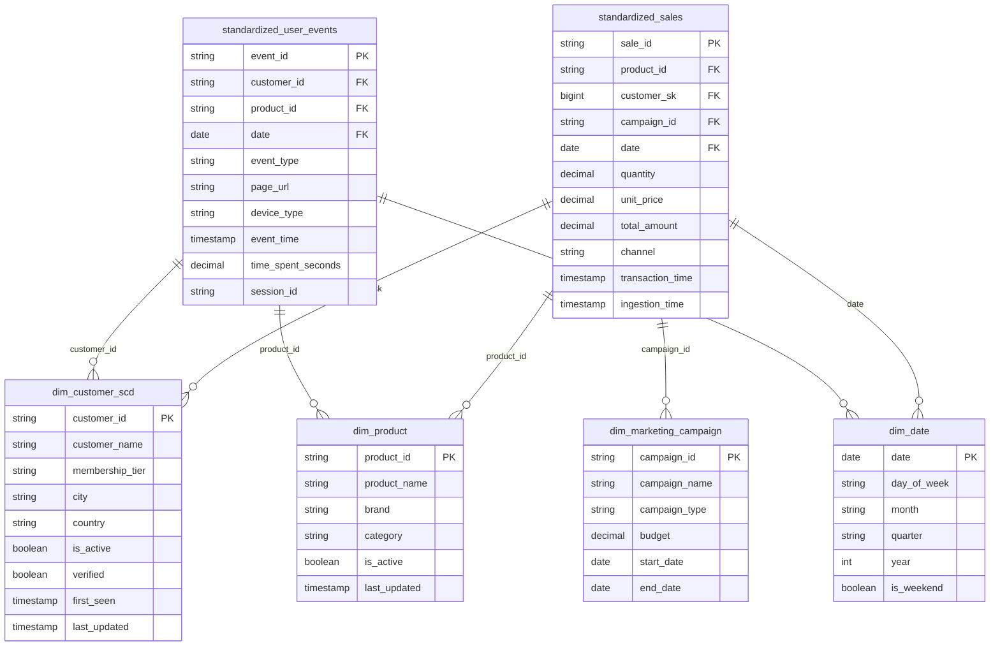

```mermaid
erDiagram
standardized_sales {
    string sale_id PK
    string product_id FK
    bigint customer_sk FK
    string campaign_id FK
    date date FK
    decimal quantity
    decimal unit_price
    decimal total_amount
    string channel
    timestamp transaction_time
    timestamp ingestion_time
}

standardized_user_events {
    string event_id PK
    string customer_id FK
    string product_id FK
    date date FK
    string event_type
    string page_url
    string device_type
    timestamp event_time
    decimal time_spent_seconds
    string session_id
}

dim_customer_scd {
    string customer_id PK
    string customer_name
    string membership_tier
    string city
    string country
    boolean is_active
    boolean verified
    timestamp first_seen
    timestamp last_updated
}

dim_product {
    string product_id PK
    string product_name
    string brand
    string category
    boolean is_active
    timestamp last_updated
}

dim_date {
    date date PK
    string day_of_week
    string month
    string quarter
    int year
    boolean is_weekend
}

dim_marketing_campaign {
    string campaign_id PK
    string campaign_name
    string campaign_type
    decimal budget
    date start_date
    date end_date
}

standardized_sales ||--o{ dim_customer_scd : "customer_sk"
standardized_user_events ||--o{ dim_customer_scd : "customer_id"
standardized_sales ||--o{ dim_product : "product_id"
standardized_user_events ||--o{ dim_product : "product_id"
standardized_sales ||--o{ dim_date : "date"
standardized_user_events ||--o{ dim_date : "date"
standardized_sales ||--o{ dim_marketing_campaign : "campaign_id"
```
